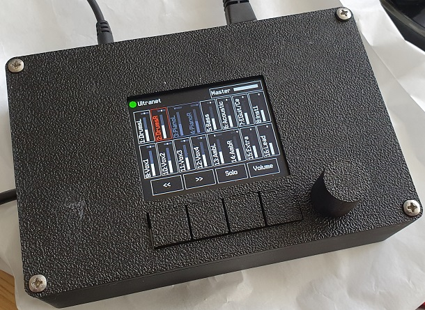

# UltranetReceiver

## Overview
This repository contains a FPGA-based receiver for audio-data based on Behringers Ultranet used in X32, P16-I, P16-M, Wing and more devices. Using a Arduino Vidor 4000 MKR FPGA-board with an Intel Cyclone 10LP, 16 Ultranet-Channels can be decoded.

This is a fork of https://github.com/xn--nding-jua/UltranetReceiver

The FPGA allows volume-control and left/right-balancing of all 16 channels into a single L/R-Signal which is output using a UDA1334 codec board. A 320x240 SPI TFT screen with 4 buttons and a rotary encoder are added for user interface control.

On my prototype unit, Ultranet in and link through jacks are provided to allow a daisy chain of units.

See original repo for how to update the code in the FPGA.

